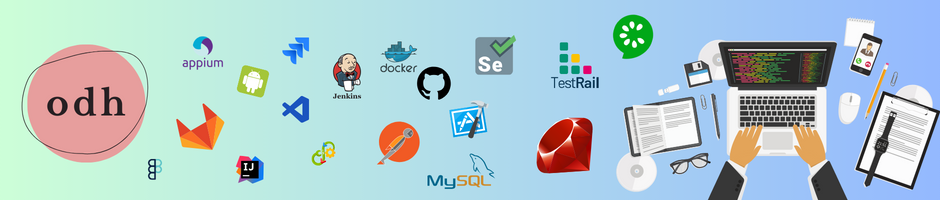

<h1 align="center">Hi there! 👋, I'm Odheta</h1>

Test Engineer with 7 years of experience in establishing and refining quality processes. Proficient in implementing and optimizing procedures to ensure high-quality product delivery. Adept at conducting tests across multiple platforms, including API, Web, and Mobile. Skilled in coaching, providing automation tools support, and addressing technical issues. Experienced in working within teams for quality purposes. Eager to contribute my expertise, fostering a culture of quality excellence and continuous improvement.

🔭 I’m currently working at **Bukalapak**

🌱 I’m assigned as **Core Quality Engineer**

<h3 align="left">Reach me on:</h3>

<h3 align="left">Work Experience:</h3>
<h5 align="left">[09/2018 - Today] Test Engineer | BUKALAPAK</h5>

 

🌸 Create a test plan and execute various test types: regression, smoke-test, sanity,
E2E, and performance tests, utilizing Xray or TestRail as the test case management
tools.

🌸 Proficient in manual and automation testing for Web, API, and Apps, including
the maintanance of integrated report tools.

🌸 Lead quality team to achieve success rates and test coverage aligned with the
defined baseline to ensure the team consistently delivers a high-quality product.

🌸 Collaborate with the IC team to enhance quality tools, supporting engineers in
improving productivity.

🌸 Work closely with automation contributors (QA and engineers) to ensure adherence to test code best practices and provide technical guidelines for automation-related processes.

🌸 Maintain the test pipeline across stages, including unit tests, integration tests,
end-to-end tests, and report integration on both Jenkins and GitLab CI/CD.

🌸 Team up to research and implement quality metrics on Grafana, with the aim of providing stakeholders with visualizations for measuring both quality and development overview.

<h5 align="left">[02/2015 - 08/2018] Embedded Test Engineer | IDEMIA</h5>

 

Handle quality process on Global Platform, particularly EMV/EMVCo projects. Cre-
ating and providing a comprehensive test plan and strategy aligned with the Software
Requirement Specification. As a associated test lead, I furnish detailed STP/STD/STR
documents and deliver a project quotation. Utilizing automation on TestNG with Java
and PCOM, to develop automation codes. In the post-regression phase, I actively track bugs and defects, conducting thorough analyses before submitting them to JIRA for resolution.

<h3 align="left">Languages and Tools:</h3>

 
 
 
 
 
 
 
 
 
 
 

 
 
 
 
 
 
 
 
 
 
 
 
 
 

